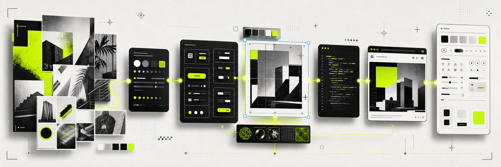
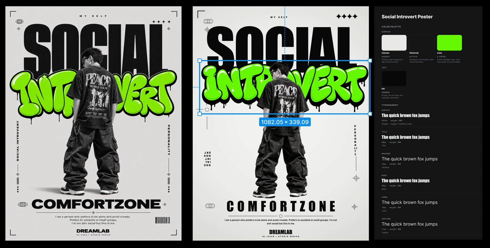
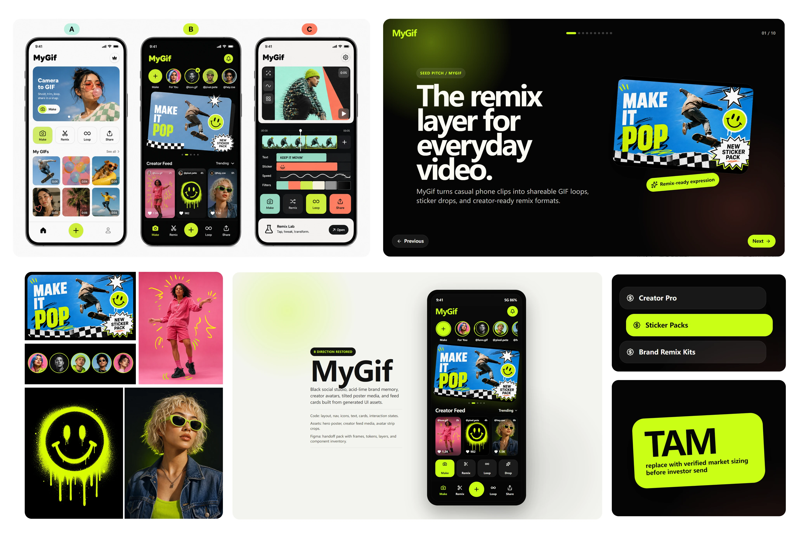
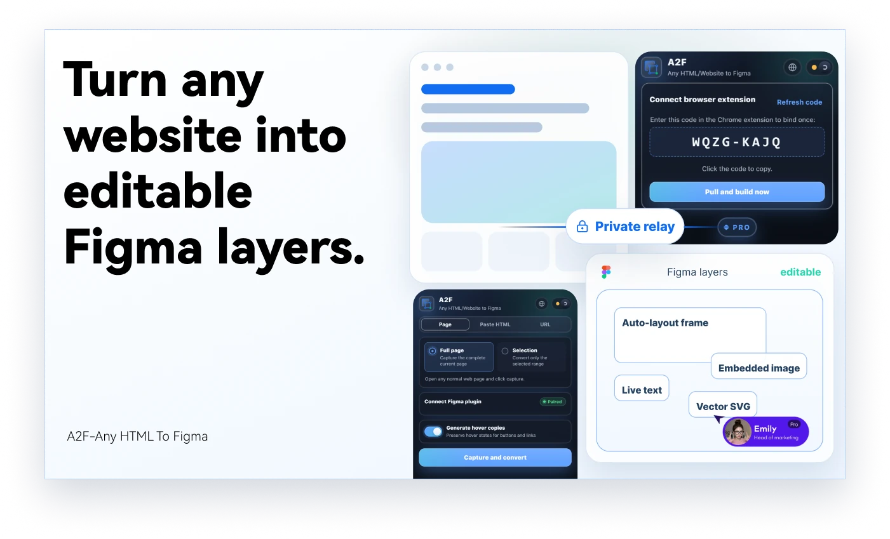
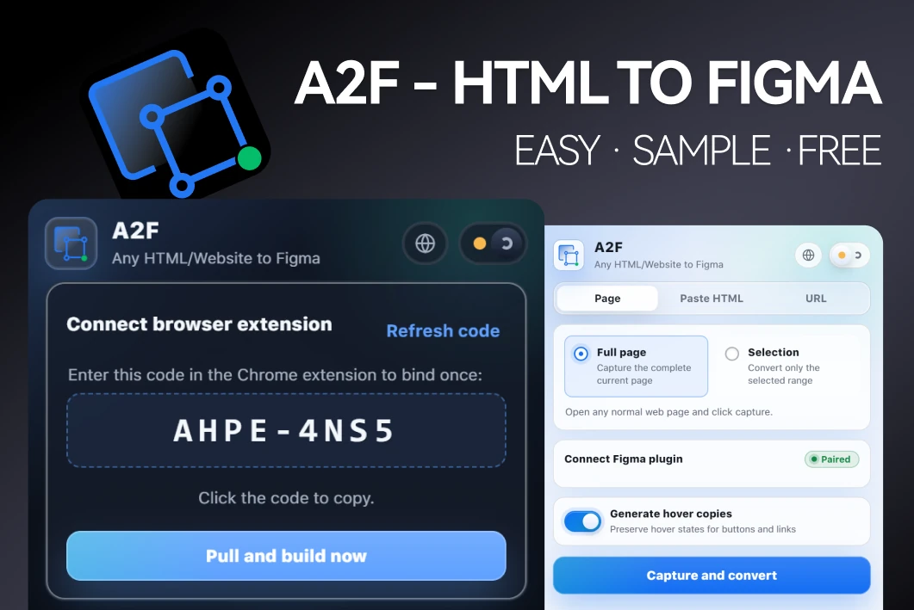

# Agent Design Skill

English | [简体中文](README.zh-CN.md)



Codex-first design skill for design scoping, image-led art direction, design-to-code implementation, asset handoff, redesign audits, editable Figma handoff, and visual QA.

This repository contains a public, self-contained `agent-design` skill. It is designed to be readable, installable as a Codex skill, and testable without private credentials.

## What It Does

- Clarifies vague design requests with concise professional range choices.
- Chooses the right mode for the task: `image-first`, `redesign`, `product-ui`, `design-dna`, `figma-export`, or `qa-only`.
- Treats new visual design as a pipeline: brief -> style exploration -> design spec -> asset extraction -> implementation/Figma -> visual QA -> preservation.
- Defaults runnable web demos to maintainable project structure, usually Vite/React/Tailwind or Next.js/Tailwind, instead of a single flat HTML file.
- Defines "slicing" as structured asset extraction: layout, text, components, and states are rebuilt in code; semantic media, icons, logos, textures, and complex illustrations become assets.
- Requires reusable design artifacts for new demos: `DESIGN.md`, tokens, asset manifest, component/section inventory, and traceability notes.
- Includes deterministic scripts for common AI-design/UX checks and pipeline validation.
- Provides optional Playwright checks for desktop/mobile layout, CTA visibility, horizontal overflow, image alt text, and basic button contrast.

## Design Pipeline Examples

The skill treats visual references as production inputs, not as flat screenshots to copy. A poster-like reference can become a structured system of type, color, assets, selection states, and implementation rules.



Concept boards can also drive implementation planning. The process separates visual direction, semantic assets, reusable components, responsive UI, and handoff notes before code is considered finished.



## HTML To Figma With A2F

This skill can pair with the [A2F Figma plugin](https://www.figma.com/community/plugin/1645412835513678534/a2f-any-html-website-to-figma-import-websites-to-figma-designs-web-html-css) to convert HTML websites into editable Figma layers. In that workflow, Codex can build or refine the HTML implementation, run visual QA, then prepare the local URL or HTML payload for A2F import.



A2F is useful when the desired handoff is not a flat screenshot, but editable Figma structure such as live text, embedded images, SVG/vector elements, and auto-layout-friendly frames.



## Repository Structure

```text
agent-design/
  SKILL.md
  agents/openai.yaml
  references/
    *.md
  scripts/
    check_skill_contract.py
    design_audit.py
    pipeline_validate.py
e2e/
  design-skill.spec.ts
  fixtures/premium-landing.html
package.json
playwright.config.ts
```

## Install As A Codex Skill

Copy or symlink `agent-design/` into your Codex skills directory, or install this repository through your preferred skill workflow.

Example local copy:

```bash
cp -r agent-design ~/.codex/skills/agent-design
```

Then invoke it in Codex:

```text
Use $agent-design to redesign this landing page with image-first exploration and browser QA.
```

## Self-Testing

Install dependencies:

```bash
npm install
```

Run the default deterministic checks:

```bash
npm test
```

Run checks individually:

```bash
npm run scan:privacy
npm run test:contract
npm run test:audit
```

Run optional Playwright visual checks against the built-in fixture:

```bash
npm run test:e2e
```

If Playwright browsers are not installed yet, run:

```bash
npx playwright install chromium
```

Run Playwright against a local app:

```bash
TARGET_URL=http://localhost:3000 npm run test:e2e
```

On Windows PowerShell:

```powershell
$env:TARGET_URL="http://localhost:3000"; npm run test:e2e
```

## Privacy And Public-Repo Hygiene

This repository is intended to be public. It should not contain:

- API keys, tokens, cookies, `.env` files, or account credentials.
- Private user data, customer content, screenshots from private sessions, or local absolute paths.
- Generated output directories such as `output/`, `website/`, Playwright reports, or `node_modules/`.

The skill does not require hardcoded model names or credentials. If an external image or design API is used, configure it in the user's environment and let the agent read that configuration at runtime.

## Platform Note

This skill is optimized for Codex and similar environments that can generate images and inspect pages in a browser. Other agents can still use the written process, but image generation and browser verification are first-class assumptions.

## References

The implementation is original, but it synthesizes public design-skill ideas and cites sources in [agent-design/references/source-index.md](agent-design/references/source-index.md).

Primary references:

- Impeccable: https://impeccable.style/
- Taste Skill: https://github.com/Leonxlnx/taste-skill
- Agent Skills Hub AI Design list: https://agentskillshub.top/best/ai-design/
- Dominik Kundel's Codex image-first design-to-app idea: https://x.com/dkundel/status/2049591675518165134

## License

MIT. See [LICENSE](LICENSE).
