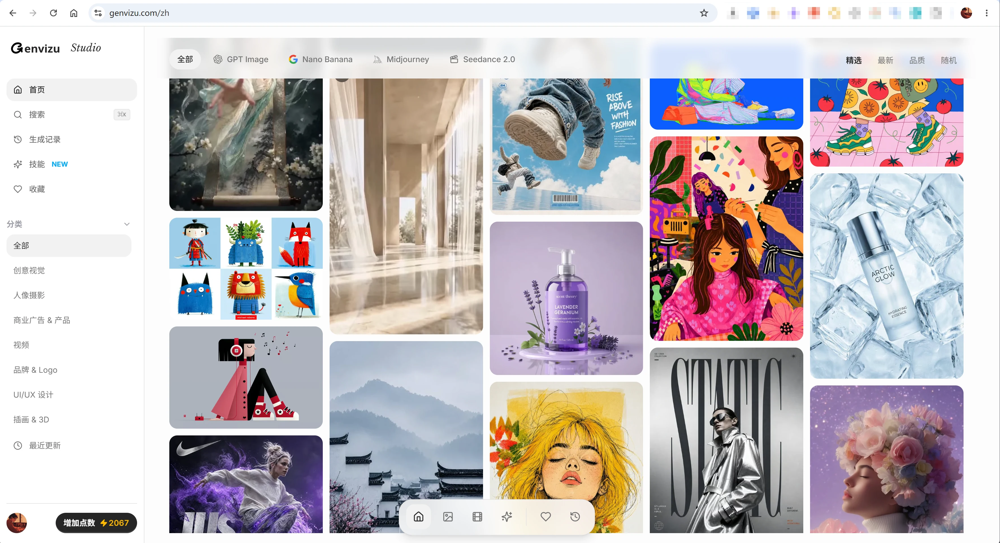
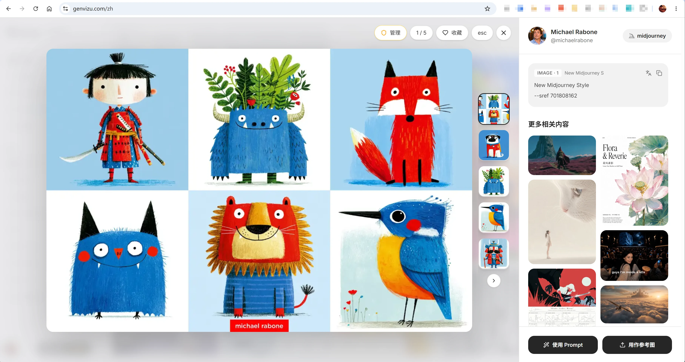
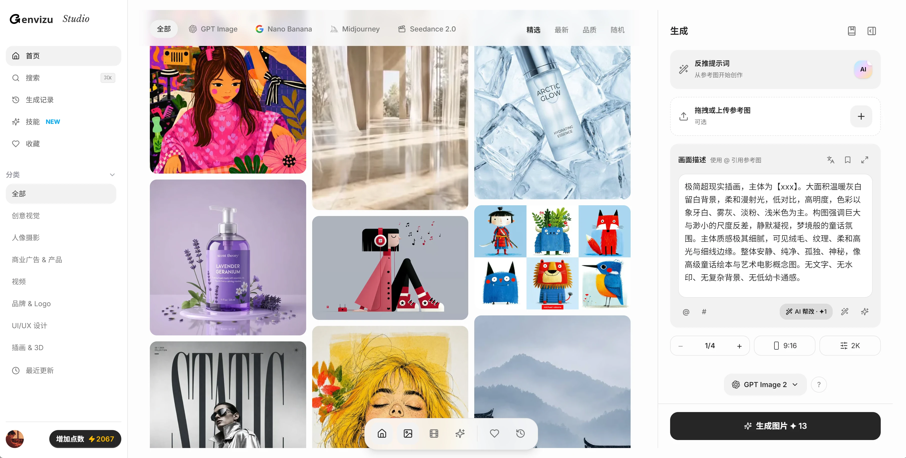
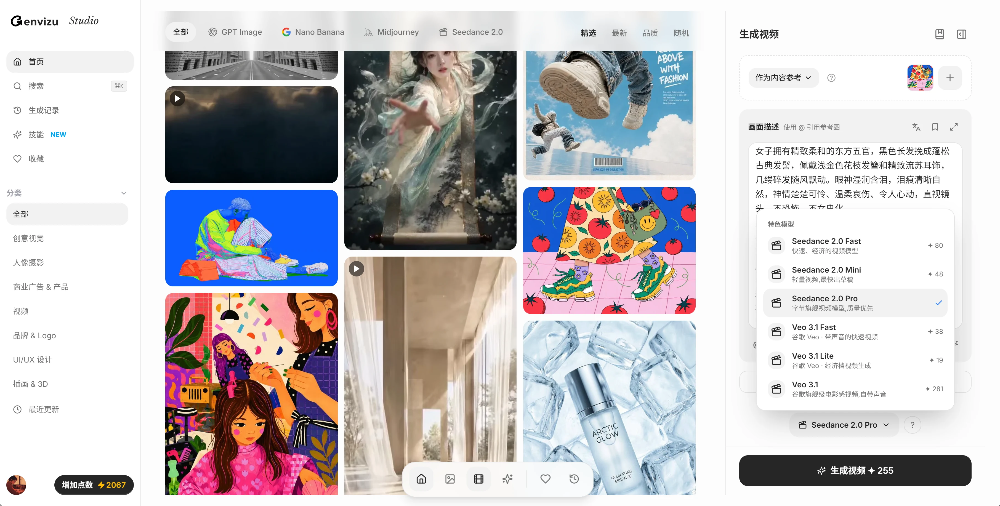

# Agent Design Skill

[English](README.md) | 简体中文


面向 Codex 的设计 skill，用于设计范围澄清、图像优先的美术方向探索、设计转代码、资产交付、重设计审计、可编辑 Figma 交付和视觉 QA。

这个仓库包含一个公开、完整、可测试的 `agent-design` skill。默认 README 使用英文，本文档提供中文版说明，方便中文使用者快速理解和安装。

## 功能概览

- 当设计需求模糊时，用简洁的专业范围选项帮助澄清。
- 根据任务选择合适模式：`image-first`、`redesign`、`product-ui`、`design-dna`、`figma-export` 或 `qa-only`。
- 把新的视觉设计视为完整流水线：brief -> style exploration -> design spec -> asset extraction -> implementation/Figma -> visual QA -> preservation。
- 对可运行网页 demo 默认使用可维护项目结构，通常是 Vite/React/Tailwind 或 Next.js/Tailwind，而不是单文件 HTML。
- 将“切图”定义为结构化资产提取：布局、文字、组件和状态用代码重建；语义媒体、图标、logo、纹理和复杂插画进入 assets。
- 新 demo 需要沉淀可复用设计资产：`DESIGN.md`、tokens、asset manifest、组件/section 清单和 traceability notes。
- 内置确定性脚本，用于检查常见 AI 设计痕迹、基础 UX 问题和 pipeline 完整性。
- 提供可选 Playwright 检查，用于桌面/移动端布局、CTA 可见性、横向溢出、图片 alt 和基础按钮对比度。

## 设计流水线示例

这个 skill 会把视觉参考当作生产输入，而不是要照抄的平面截图。海报类参考可以被拆解成字体、颜色、资产、选区状态和实现规则。


概念板也可以驱动实现规划。流程会在完成代码前，把视觉方向、语义资产、可复用组件、响应式 UI 和交付说明拆清楚。


## 前期找灵感网站

本 skill 前期对于风格探索非常重要，推荐 [GenVizu](https://genvizu.com/)。此网站整理了 1W+ 大佬们的提示语精选，有丰富的各类场景的提示语，可以直接基于此进行创作。



Gallery 提示语详情页可以查看提示语、作者/来源信息、相关内容和参考图操作，适合在确定风格方向前做提示语拆解。



GenVizu 提供 GPT-Image-2、Midjourney 8.1、Nano Banana 2 等生图模型；还有 Seedance 2.0、Veo 3.1 等视频生成模型，真可以一站式解决 AI 生图、生视频的需求。





## 配合 A2F 实现 HTML 到 Figma

这个 skill 可以配合 [A2F Figma 插件](https://www.figma.com/community/plugin/1645412835513678534/a2f-any-html-website-to-figma-import-websites-to-figma-designs-web-html-css)，把 HTML 网站转换成可编辑的 Figma 图层。在这个流程里，Codex 可以先构建或调整 HTML 实现，完成视觉 QA，然后把本地 URL 或 HTML payload 准备给 A2F 导入。


A2F 适合用于需要可编辑 Figma 结构的交付，而不是只交付一张扁平截图；例如 live text、嵌入图片、SVG/vector 元素和更接近 auto-layout 的 frame 结构。


## 仓库结构

```text
agent-design/
  SKILL.md
  agents/openai.yaml
  references/
    *.md
  scripts/
    check_skill_contract.py
    design_audit.py
    pipeline_validate.py
e2e/
  design-skill.spec.ts
  fixtures/premium-landing.html
package.json
playwright.config.ts
```

## 作为 Codex Skill 安装

将 `agent-design/` 复制或软链接到你的 Codex skills 目录，或通过你偏好的 skill 工作流安装这个仓库。

本地复制示例：

```bash
cp -r agent-design ~/.codex/skills/agent-design
```

然后在 Codex 中调用：

```text
Use $agent-design to redesign this landing page with image-first exploration and browser QA.
```

## 自测

安装依赖：

```bash
npm install
```

运行默认确定性检查：

```bash
npm test
```

单独运行检查：

```bash
npm run scan:privacy
npm run test:contract
npm run test:audit
```

运行可选 Playwright 视觉检查，默认使用内置 fixture：

```bash
npm run test:e2e
```

如果 Playwright 浏览器还没有安装，先运行：

```bash
npx playwright install chromium
```

对本地运行中的应用执行 Playwright 检查：

```bash
TARGET_URL=http://localhost:3000 npm run test:e2e
```

Windows PowerShell：

```powershell
$env:TARGET_URL="http://localhost:3000"; npm run test:e2e
```

## 隐私和公开仓库要求

这个仓库面向公开发布，不应包含：

- API keys、tokens、cookies、`.env` 文件或账号凭据。
- 私人用户数据、客户内容、私有会话截图或本机绝对路径。
- 生成产物目录，例如 `output/`、`website/`、Playwright 报告或 `node_modules/`。

这个 skill 不需要硬编码模型名称或凭据。如果使用外部图像或设计 API，请在用户环境中配置，让 agent 在运行时读取配置。

## 平台说明

这个 skill 针对 Codex 和类似环境优化，假设运行环境可以生成图像并在浏览器中检查页面。其他 agent 也可以参考其中的流程，但图像生成和浏览器验证是它的一等能力假设。

## 参考来源

实现本身是原创的，但综合并引用了一些公开设计 skill 思路。完整来源见 [agent-design/references/source-index.md](agent-design/references/source-index.md)。

主要参考：

- Impeccable: https://impeccable.style/
- Taste Skill: https://github.com/Leonxlnx/taste-skill
- Agent Skills Hub AI Design list: https://agentskillshub.top/best/ai-design/
- Dominik Kundel 的 Codex image-first design-to-app 想法: https://x.com/dkundel/status/2049591675518165134

## License

MIT。见 [LICENSE](LICENSE)。
